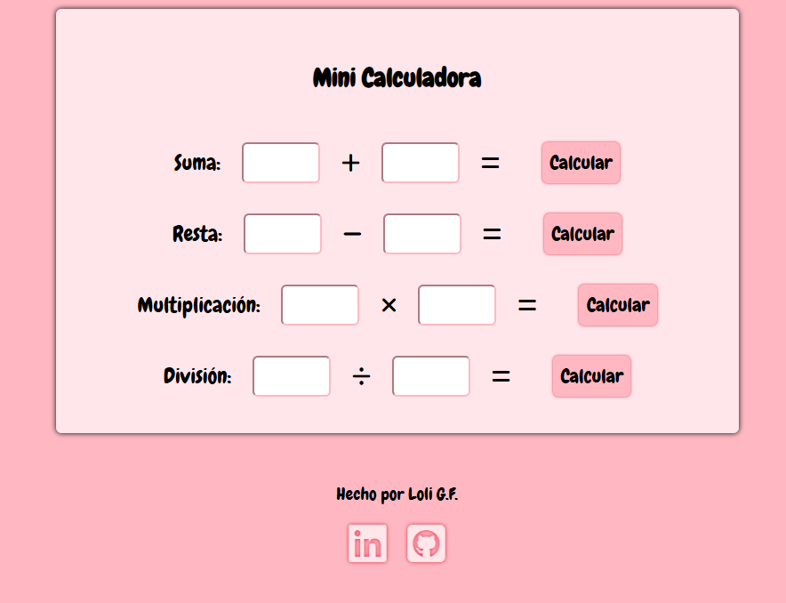

<h1>Mini calculadora</h1>

Este proyecto consiste en crear un calculadora simple en la que se calcula cada línea.

Hay una línea para sumar, restar, multiplicar y dividir.

 

 
<a href="https://codepen.io/loli-gf/pen/azvVWxG" target="_blank">Enlace al proyecto en CodePen</a>